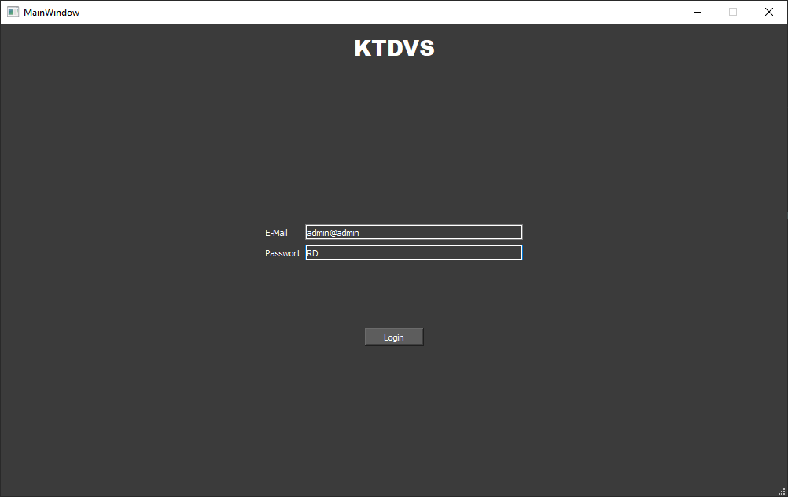
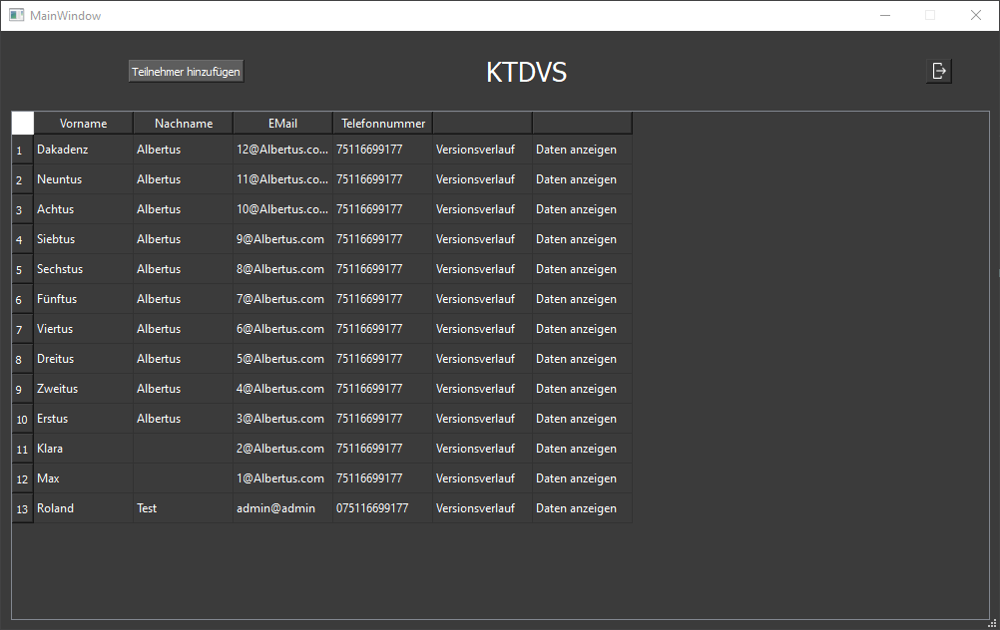
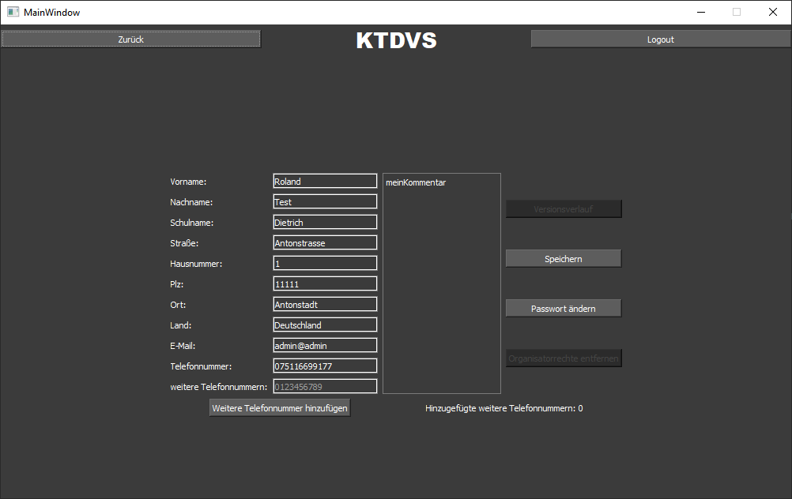
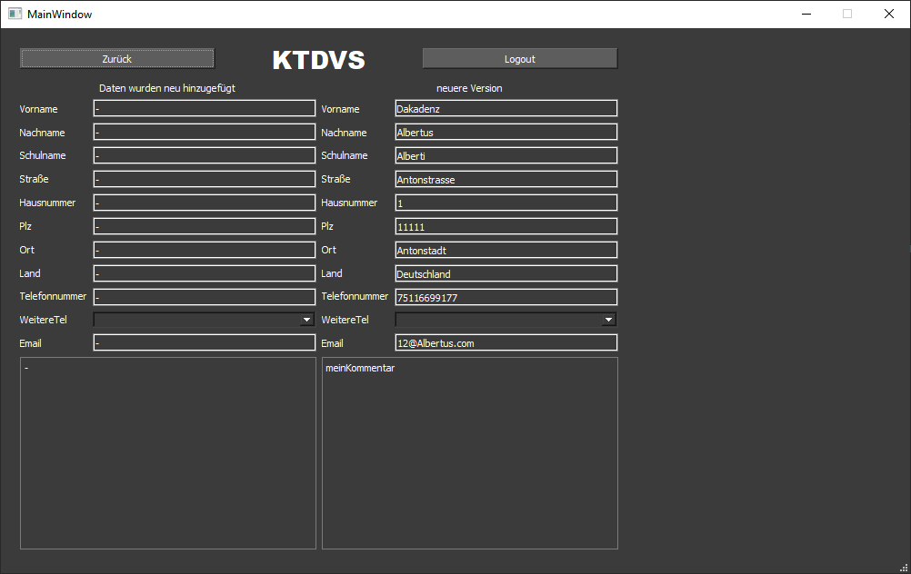
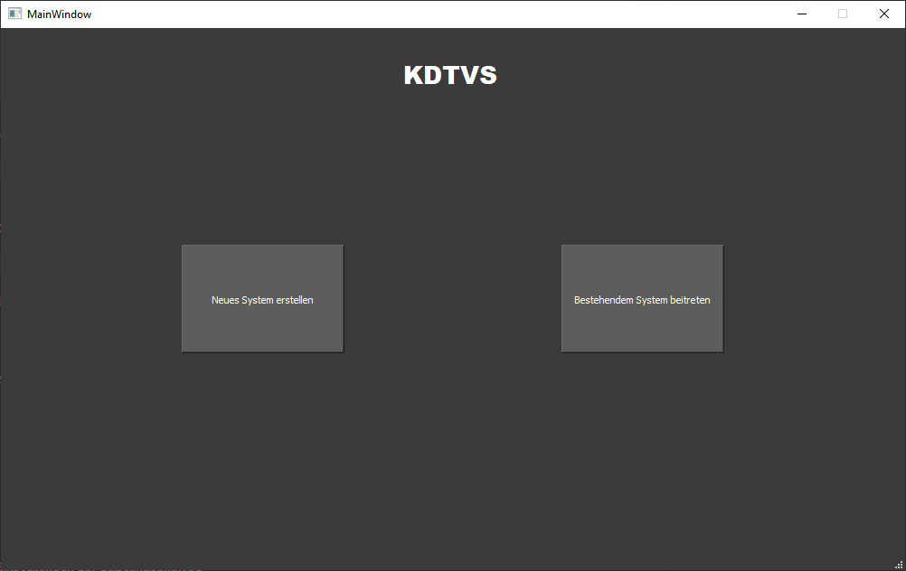
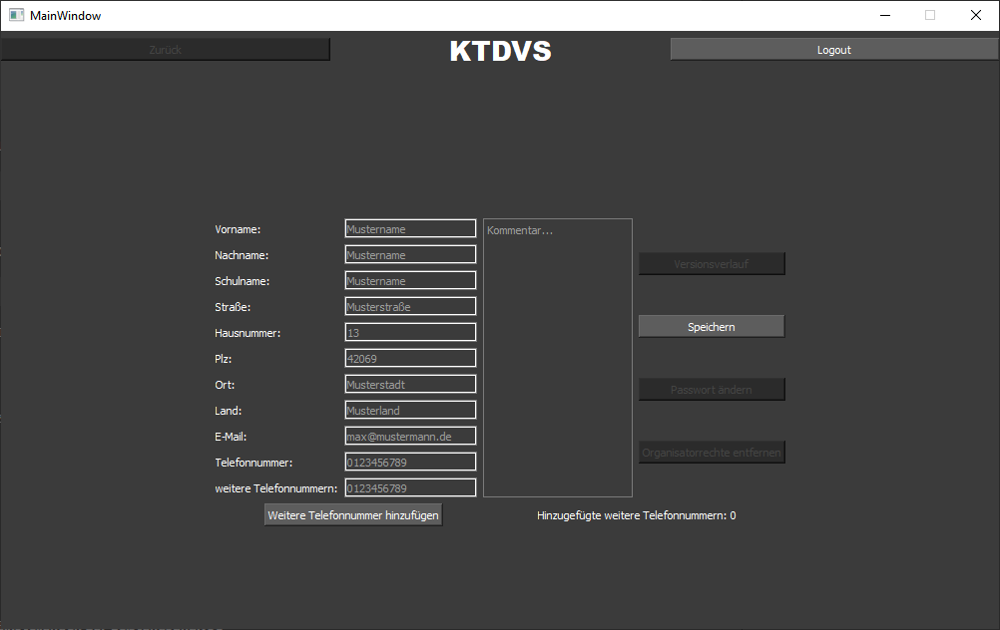
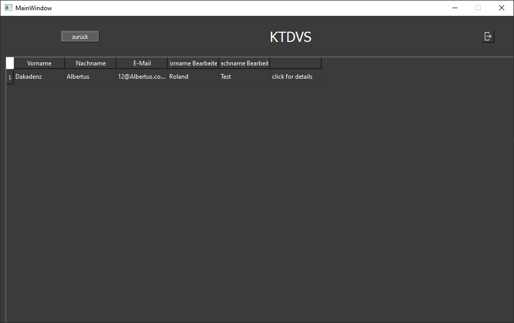
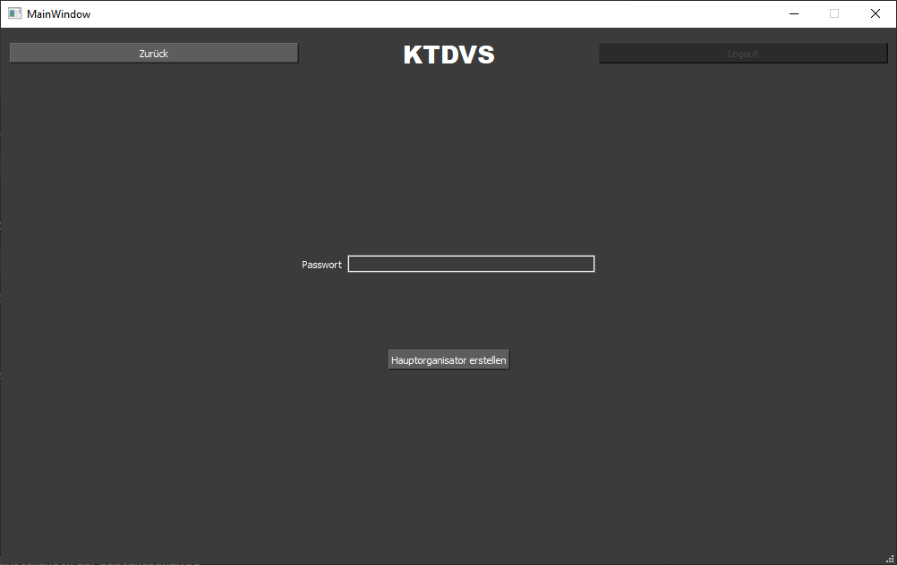
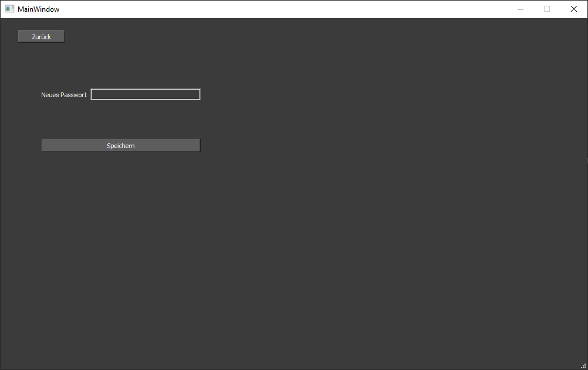
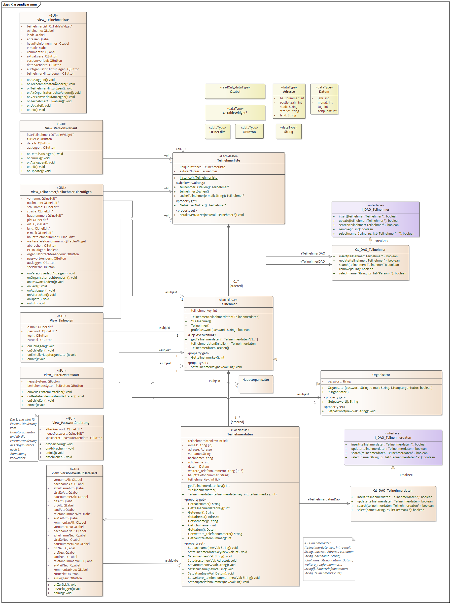

# 🧑‍🎓 KTDVS – Class Reunion Data Management Software

**KTDVS** is a desktop application designed to simplify the organization of class reunions by managing participant data with access control and version tracking.

  
  

  
  

---

## 🎓 Project & Context

This project was developed during the **Software Engineering** course at **Aalen University** in the **summer semester of 2021**.

The goal was to go through a complete software development process, including:

- Requirements engineering (IEEE 830)
- Architecture and database design
- GUI development
- Implementation in C++ with Qt
- Persistent data storage using SQLite

For using it on multiple devices the sqlite database has to be shared. 
This can be done by putting the database-file on a network storage or cloud providers storage like Dropbox or GoogleDrive.

---

## 🧩 Key Features

- ✏️ Add, edit, and delete participants
- 📖 View individual change history (versions)
- 📜 Per user history of all data changes
- 🔐 Role-based user access (admin vs. editor)
- 💾 Persistent local storage (SQLite)
- 👤 Role system: main organizer and co-organizers
- 🧠 Qt-based modern GUI

Full requirements available in  
📄 [IEEE 830 Requirements Specification (PDF)](docs/SoftwareAnforderungenIEEE.pdf)

---

## 👤 User Roles

### Main Organizer (Admin)
- Created upon initial setup
- Can:
    - Add/remove organizers
    - Set/reset passwords
    - Edit all participant data
    - View all histories
    - Promote participants to organizers

### Organizer
- Appointed by the main organizer
- Can:
    - Add/edit/delete participants (limited to own entries)
    - View all participants
    - View full change/version history

> Participants themselves **do not** have access to the system.

---

## 🎞️ Feature Highlights

### 🔐 User Management

The application is secured by **E-Mail and password** implemented using a **sqlite** database.
Users can be invited, promoted and then log in. Alternatively a new system can be created.

  
  

---

### ✏️ Managing Users

Via the application it its possible to create, view and edit users.
The first view shows all users in the application.

   

Using the button "Teilnehmer hinzufügen" you can navigate to a new form 
to create new users. After inserting all relevant data you dan save the 
user using the "Speichern" button. You will be navigated back to the list view.

  

By clicking on a user you come to a view, similar to the creation view. 
Here you can edit the already existing user.

  

---

### 📖 Versioning users

When you want to see how the data was edited since its creation you can open a version list by clicking
"Versionsverlauf". Here all changes are listed done to that user.

  

If you want to see more details about the change you can click at an item on the 
list and you will be navigated to a form listing the data before and after that change.

  

### 👤 Promoting users

Single users can be promoted to become organizers.
The promoter will receive a **one time password** for the new organizer.
The new organizer can login with it and replace the password with its own.
If an organizer uses 3 times a wrong password, the account is locked and the user has to inform the system owner.
The system owner can reset the password using the promote view.

  
  

---

## 🧠 Technical Architecture

- **Pattern:** 3-layer architecture
    - UI (Qt Widgets)
    - Application logic
    - Data access (DAOs)
- **Language:** C++17
- **Framework:** Qt (tested with Qt Creator)
- **Database:** SQLite (single-file)

A class diagram of the app can be seen below:

  

> Diagrams and explanations can be found in the [design documentation](docs/Entwurf.pdf)

---

## 💡 What We Learned

- Applying software engineering methodologies (IEEE 830)
- GUI application architecture in Qt (C++)
- Role-based access control
- Managing state and data persistence
- Implementing change/version tracking on database entities

---

## 🧑‍💻 Teamwork makes the Dream Work

Developed by:

- Maximilian Borst
- Jan Kermer
- Simon Ruttmann
- Veronika Scheller
- Michael Ulrich

---

## 📜 License

Licensed under the **Apache 2.0 License**.  
Feel free to fork or reuse — just give proper credit. 🤝

---

## 📦 Running the Project

> **Requirements:**
> - Qt Creator (v5 or later)
> - C++17 compiler
> - SQLite support
>
> Clone or download this repository, open the `.pro` file in Qt Creator, build, and run.

---

## 🖼️ Screenshots

More screenshots are available in the `/media/screenshots` folder.  
A full interactive prototype is available via [Figma Prototype](https://www.figma.com/proto/tc3G3hYe6vGsbr1jqEykhL/KTDVS?node-id=4%3A53)

---
